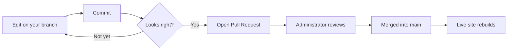

<style>
    @media (min-width: 1650px) {
        #main-wrapper>.container {
            max-width: 1600px;
            padding-left: 1.75rem !important;
            padding-right: 1.75rem !important;
        }
    }
    .example {
        display: grid;
        gap: 1rem;
    }
    @media (min-width: 640px) {
        .example {
            grid-template-columns: 1fr 1fr;
        }
    }
    iframe {
        width: 100%;
    }
</style>

# Welcome

This guide is written for program participants who will author interactive visual narratives on the Plant Humanities Lab platform. By the end of it you will be able to:

* Edit pages directly in your browser and see your changes within seconds
* Write a plant narrative using only Markdown
* Add interactive images, side-by-side comparisons, maps, videos, and timelines
* Drive those visuals from links in your own writing
* Submit a finished narrative for review and publication

No prior experience with GitHub, Jekyll, or Markdown is assumed. Read straight through the first time, then come back to individual sections as a reference while you are writing.

---

# Part 1 — What You Are Doing

## What Is StoryKit?

**StoryKit** is the name used on this site for a streamlined version of **Juncture**, a visual narrative authoring and display framework. Juncture grew out of a 2018 digital humanities collaboration between **JSTOR Labs** and **Dumbarton Oaks**, with one straightforward goal:

> Enable students and scholars to create interactive visual narratives using Markdown — without requiring coding skills.

Juncture was created to make it easier to build web-based visual narratives that combine prose with rich visual and interactive content. StoryKit keeps that same core idea but in a simpler form tailored for this site, built directly on Jekyll instead of relying on heavy custom infrastructure.

For authors, the important point is that StoryKit lets you write mostly in regular Markdown while adding special instructions where you want interactive viewers to appear — images, maps, videos, timelines, and other media. You do not need to understand the technical details. You mainly need to know how to edit a Markdown file, add the appropriate StoryKit viewer instructions, preview your work, and submit it for review.

## What You Are Creating

A **visual narrative** is a web page that combines written text with interactive media. A StoryKit visual narrative may include:

* Text written in Markdown
* Plain images and high-resolution zoom-and-pan viewers
* Side-by-side before/after image comparisons
* Maps with markers, custom layers, and fly-to animations
* YouTube videos with timestamp jumping
* Embedded timelines and other interactive content

You write the narrative in a plain text file using Markdown, with StoryKit instructions added where interactive viewers should appear. When the site is published, GitHub Pages and Jekyll convert that file into a finished web page.

## A Few Terms You Should Know

You don't need to be a GitHub or Jekyll expert, but a few terms come up throughout this guide.

**GitHub repository.** The website is stored in a GitHub repository. Think of the repository as the project folder for the website. It contains every file needed to build the site, including all the visual narratives.

**Branch.** A separate working copy of the website. The live site is built from the `main` branch; only designated people can change main directly. Authors work in their own branches, which lets them write, revise, and preview without affecting the public site.

**Commit.** GitHub's version of a save. When you commit, you save your changes to your branch. Each commit can include a short comment ("commit message") describing what changed, such as *Add introduction section* or *Fix typo in caption*.

**Jekyll.** The tool that turns the source files into finished web pages. You will never run Jekyll yourself. GitHub Pages runs Jekyll automatically when the site is published, and the preview tool imitates the same process so you can check your work in advance.


**Markdown.** A simple way to write formatted text using plain text. Headings, lists, links, and emphasis all have lightweight equivalents in Markdown that are much easier to type than HTML.

**StoryKit viewer.** An interactive element you can insert into a visual narrative — an image viewer, a map, a YouTube video, and so on. Viewers are added with Liquid tags.

**Preview tool.** A small utility that lets you see a high-quality preview of your visual narrative while you are still editing it. It closely imitates the way the final site will render the page.

**Pull request.** How you ask for your completed changes to be reviewed and possibly published. When your narrative is ready, you open a pull request from your working branch into `main`. An administrator reviews the changes and decides whether to merge them.

---

# Part 2 — Getting Started

## Before You Begin

Before you begin authoring, you need:

* A GitHub account
* Your GitHub username added to the website repository with permission to create branches and edit files

The site is already set up and configured. A program administrator will direct you to the GitHub repository you should use and add your username to it. If you can view the repository in GitHub but you don't see a pencil icon next to files, or you can't create a branch, your account hasn't been added yet — ask the administrator.

## Creating a GitHub Account

GitHub is a free service. To create an account:

1. Go to <https://github.com> and click **Sign up**.
2. Use an email address you can check. School or work email works fine.
3. Pick a username. Your username will appear in URLs and in commit history, so choose something you don't mind being public — many people use a variant of their name.
4. Verify your email through the confirmation message GitHub sends.

> **Pick your username carefully.** Changing it later is possible but breaks links to your work. A short, professional-looking username serves you well past this program.
> {: .prompt-tip }

Once your account is active, share your username with the program administrator so it can be added to the repository.

## Working on Your Own Branch

Once you have access to the repository, the first thing to do is move off the `main` branch and onto your own.

1. In the repository on GitHub, click the branch selector near the top of the file list. It usually reads **main**.
2. In the box that appears, type a branch name. Use lower-case letters and hyphens — for example `mango-narrative`, `mary-map-updates`, or `team-rose-draft`. Pick something that briefly describes the work you're doing.
3. Click **Create branch: `<your-name>` from `main`**.

You are now on your own branch. Any edits you make from this point on affect only this branch until you ask for them to be merged into `main`.



> **Why work on a branch?** While you experiment on your branch, the published version of the site keeps rendering from `main`. Nothing you do on a branch is visible to the public until an administrator merges it in.
> {: .prompt-tip }

Throughout the rest of the guide, **always check that the branch selector shows your branch — not `main` — before editing.**

## Using the Preview Tool

When you commit a change on GitHub, the live site does not update immediately. GitHub Pages must rebuild the entire site, which takes one to five minutes. During that wait you cannot see your edits.

The **StoryKit preview tool** sidesteps that wait by rendering a single file directly from your branch, usually in under five seconds.

### One-time setup

You install the preview tool by dragging a bookmarklet into your browser's bookmarks bar. You only do this once per browser.

1. Make sure your bookmarks bar is visible:
   * Chrome / Edge: <kbd>⌘⇧B</kbd> on macOS, <kbd>Ctrl</kbd>+<kbd>Shift</kbd>+<kbd>B</kbd> on Windows
   * Firefox: View menu → Toolbars → Bookmarks Toolbar
   * Safari: View menu → Show Favorites Bar
2. On the live site, open **Admin → StoryKit: One-Time Setup for Authors**.
3. **Drag** the blue **🔖 Preview on GitHub** button from that page up to your bookmarks bar. Do not click it — drag it.
4. Confirm that a new bookmark labelled *Preview on GitHub* now appears in your bookmarks bar.

The bookmarklet automatically builds a preview URL from the GitHub username, repository, file path, and branch of whichever `.md` page you happen to be looking at — so you don't have to build the URL by hand.

### Day-to-day use

Once the bookmarklet is installed:

1. In the repository on GitHub, open any `.md` file in the `_posts` folder.
2. Click **Preview on GitHub** in your bookmarks bar.
3. A new tab opens with the file rendered the same way the live site would render it.

The recommended setup is two browser windows side by side: the GitHub editor in one, the preview in the other. The edit cycle is:

1. Edit
2. **Commit changes**
3. Wait a few seconds
4. Reload the preview

Repeat until you are happy with the result. You do not need to install any software on your computer; the entire workflow runs in your web browser.

> **If the preview fails to open**, check that you launched the bookmarklet while looking at a `.md` file (not a folder or another file type). The bookmarklet only works on `.md` pages inside a repository.
> {: .prompt-warning }

---

# Part 3 — Markdown Basics

The text of every visual narrative is written in **Markdown**, a plain-text format for writing styled documents. You will never need to write HTML by hand. Markdown is small enough to learn in an afternoon; the rest of this part covers everything you need for a polished article.

A Markdown file has two parts:

1. **Front matter** — a block at the very top, between two `---` lines, that tells the site what the post is and how to display it.
2. **Body** — everything below the front matter. This is your narrative.

A minimal narrative looks like this:

```markdown
---
title: The Mango Tree
description: A short cultural history of the mango.
authors:
  - Your Name
date: 2026-06-10
categories: [examples]
tags: [mango, tropical-fruits]
published: false
media_subpath: /assets/posts/mango
image:
  path: mango_header.jpg
  alt: A mango tree in full fruit
storykit: true
---

The mango tree...
```
{: .nolineno }

Three lines deserve special attention:

* `published: false` keeps your narrative hidden from the live site until you are ready.
* `media_subpath` must match exactly the name of the folder where you upload images for this narrative. The convention is `/assets/posts/<narrative-slug>/`.
* `storykit: true` turns on the interactive viewers described in Part 4. Without it, only standard Markdown works.

The file `_posts/.template.md` in the repository is a starter you can copy when creating a new narrative.

## 3.1 Creating a New Narrative File

The main file for a visual narrative is a Markdown file stored in the `_posts` directory. To create a new one:

1. In the repository (on **your** branch), navigate to the `_posts` folder.
2. Open `.template.md` and copy its contents.
3. Click **Add file → Create new file**.
4. Name the new file following this pattern:

   ```
   yyyy-mm-dd-narrative-name.md
   ```
   {: .nolineno }

   For example:

   ```
   2026-06-10-mango.md
   ```
   {: .nolineno }

   Use hyphens instead of spaces in the narrative name. The date at the beginning is important because Jekyll uses it to organise posts.
5. Paste the template contents into the new file and fill in the front matter.
6. **Commit changes** to save it to your branch.

## 3.2 Headers and Section Titles

A **header** is a line of text marked as a heading. The number of `#` characters at the start of the line sets its level.

```markdown
# Top-level section
## Sub-section
### Sub-sub-section
```
{: .nolineno }

* `#` is the title of a major section.
* `##` is a section within that.
* `###` and below nest further.

The very first line of your article should not be a `#` header — your `title:` in the front matter is already rendered as the page's main heading. Begin the body with `#` for the first section of your narrative.

> A blank line is required before and after every header. Without the blank line above it, the header is rendered as part of the previous paragraph.
> {: .prompt-warning }

The site automatically builds a table of contents from your headers when `toc: true` is set in the front matter (it is on by default).

## 3.3 Italics, Bold, and Other Emphasis

Wrap text in asterisks or underscores to emphasise it.

```markdown
*italic*           or   _italic_
**bold**           or   __bold__
***bold italic***  or   ___bold italic___
~~strikethrough~~
```
{: .nolineno }

Use italics for the scientific name of a plant (*Mangifera indica*), for the title of a book or journal, and for foreign-language words on first use. Use bold sparingly — it is loud and quickly becomes noise if used in every paragraph.

## 3.4 Popovers (Entity Information Boxes)

A **popover** is a small information panel that appears when a reader clicks a linked term in your text. Instead of sending the reader off to Wikipedia and breaking their reading flow, the relevant facts appear in place.

Popovers are powered by **Wikidata**, a free, structured database maintained by the Wikimedia Foundation. Almost every notable person, place, plant, organisation, and concept has a Wikidata entry, and each entry has a short identifier that starts with `Q`.

### Finding a Wikidata identifier

1. Search Wikipedia for the subject.
2. On the Wikipedia article, look in the left-hand sidebar for **Wikidata item**.
3. The page that opens shows the identifier at the top — for example **Q156928** for *Viburnum opulus*.

### Writing the link

The link in Markdown is identical to a normal link, except the URL is just the Q-identifier.

```markdown
The work of [Charles Darwin](Q1035) shaped modern biology.
```
{: .nolineno }

When the reader clicks **Charles Darwin**, a popover opens with his portrait, dates, summary, and a link to Wikipedia.

A worked example: the flowering shrub *[Viburnum opulus](Q156928)* is native to Europe, north Africa, and northern Asia. It was studied by [Carl Linnaeus](Q1043) and given the common name *guelder rose* after the [Gelderland](Q775) region of the Netherlands.

> Use popovers selectively. One per concept is plenty; linking the first meaningful mention of a person, place, or species is usually enough.
> {: .prompt-tip }

## 3.5 URLs (Links)

A normal link looks the same as a popover link, except the URL points to a website.

```markdown
[Plant Humanities Lab](https://lab.plant-humanities.org)
```
{: .nolineno }

You can also drop a raw URL into your text by wrapping it in angle brackets:

```markdown
Visit <https://lab.plant-humanities.org> to see published narratives.
```
{: .nolineno }

For links to a place inside the same article, use the auto-generated anchor for the header you want to jump to. Each header gets an anchor made by lower-casing the text and replacing spaces with hyphens.

```markdown
See the [Map Viewer](#43-map-viewer) section below.
```
{: .nolineno }

## 3.6 Footnotes

Footnotes let you cite sources without cluttering the prose. Kramdown (the Markdown processor Jekyll uses) supports them with a two-part syntax.

1. In the body, place a marker where the footnote should appear.
2. Anywhere later in the file — usually at the bottom — write the definition.

```markdown
The guelder rose plays a prominent role in Ukrainian folk song.[^1]

Charred remains have been found at Mesolithic settlements
on the Baltic coast.[^baltic]

[^1]: Smith, *Folk Songs of the Dnipro*, 142.
[^baltic]: Bjerck, "Coastal Mesolithic Diet", *Antiquity* 78 (2004), 287–294.
```
{: .nolineno }

A few things to know:

* The marker can be a number (`[^1]`), a word (`[^baltic]`), or anything that does not contain spaces. Numbers are renumbered automatically in the order they appear, so you don't have to keep them in sequence.
* The definition lines must each start at the left margin.
* A blank line is required before the first definition.
* Clicking a footnote in the rendered article scrolls the reader to the definition and adds a back-arrow that returns them.

---

# Part 4 — The Content Viewers

The content viewers are what set the Plant Humanities Lab platform apart from a normal blog. They are interactive components — images you can zoom into, maps you can fly around, before-and-after sliders, embedded videos — and they are inserted into your Markdown with a single line.

The line uses Jekyll's **Liquid include** syntax. It looks like this:

```liquid

```
{: .nolineno }

You do not need to understand Liquid in detail. Copy an example from this guide, change the attribute values to your own, and you are done.

Three rules apply to every viewer:

1. The narrative's front matter must include `storykit: true`.
2. Attribute values must be in straight double quotes (`"value"`), not curly quotes (`"value"`).
3. If you want to drive the viewer from a link in your text — for example, a "zoom in here" link — you must give the viewer an `id`.

## 4.1 Image Viewer

The Image Viewer displays an image that looks like an ordinary picture. When the reader clicks it, a large, high-resolution viewer opens with smooth zoom and pan. This is the right component for any image whose detail matters — herbarium specimens, archival photographs, botanical illustrations, paintings.

### Using a Wikimedia Commons image

[Wikimedia Commons](https://commons.wikimedia.org) is the free media library that powers Wikipedia. The platform has first-class support for it, including automatic caption, attribution, and license handling.

To use a Commons image:

1. Find the image on Commons.
2. Copy the file name. It appears at the top of the file page — for example, `File:Monument Valley, Utah, USA.jpg`.
3. In your Markdown, reference it with the shorthand `wc:File_Name.jpg` (replace spaces with underscores; do not include the leading `File:`).

<div class="example">
<div markdown="1">

```liquid

```

{: .nolineno }
</div>

<div>

</div>
</div>

Caption, photographer credit, and license text are pulled automatically — you don't need to type them in. Wikimedia Commons is a useful source for visual narrative images because most files are public domain or available under open licenses; even so, take a moment to review the Commons file page to confirm what's required.

### Using a locally hosted image

A "local" image is one you have uploaded into the repository. Use a local image when:

* The image isn't available on Wikimedia Commons
* You have permission to use a specific image from a museum or archive
* You need a specific size or crop that Commons doesn't provide

To upload and reference a local image:

1. In the repository on your branch, navigate to `assets/posts/`.
2. Use **Add file → Create new file** to create a folder for your narrative — for example `assets/posts/mango/`. (Type the folder name followed by `/` in the new-file name to create the folder.)
3. Use **Add file → Upload files** to upload your image into that folder.
4. Make sure the narrative's front matter sets `media_subpath` to that folder, and that **the folder name and `media_subpath` value match exactly**.

   ```yaml
   media_subpath: /assets/posts/mango
   ```
   {: .nolineno }

5. In the include tag, use **only the file name**:

   ```liquid
   
   ```
   {: .nolineno }

Because `media_subpath` is set, the platform automatically resolves `mango_specimen.jpg` to `/assets/posts/mango/mango_specimen.jpg`. If the image fails to load, the most common cause is a mismatch between the folder name and the `media_subpath` value.

### Useful optional attributes

| Attribute | What it does |
|---|---|
| `caption` | Text shown below the image |
| `aspect` | Sets the displayed shape — e.g. `aspect="1.33"` or `aspect="1200/630"` |
| `cover` | Set to `"true"` to make the image fill its space dramatically |
| `region` | Open the viewer zoomed into a particular area |
| `rotate` | Rotate the image by 90, 180, or 270 degrees |
| `id` | Required only if you want to target the viewer from a link |

### IIIF manifests

Some museums publish their high-resolution images using an open standard called **IIIF**. If a museum provides a IIIF manifest URL, you can use it directly:

```liquid

```
{: .nolineno }

The viewer loads the manifest, pulls metadata from it, and displays the image at full IIIF resolution.

## 4.2 Image Compare Viewer

The Image Compare Viewer places two images on top of one another with a vertical divider the reader can drag back and forth. It is the right component for **before/after** pairs: a historical photograph against a modern view, a herbarium specimen against a field photograph, a landscape painting against the present-day landscape.

### Basic use

You need two images in the same folder — they can be local files or Wikimedia Commons files — and you set the `before` and `after` attributes.

```liquid

```
{: .nolineno }

* `before` is the image revealed as the divider is dragged left (usually the older image).
* `after` is the image visible when the divider is fully to the right (usually the newer image).
* `caption` appears below the viewer.
* `aspect` sets the shape of the expanded dialog. `1.5` suits most landscapes; `0.75` suits portraits.
* `position` sets the starting position of the divider, as a percentage from the left edge. `50` is centred; `35` puts it left of centre so the *after* image dominates initially.

When the reader clicks the preview in the page, an expanded view opens that fills the screen width.

### Aligning the two images

Two photographs taken decades apart are almost never framed identically. To line them up, open the expanded viewer in the preview, **double-click** the comparison, and the alignment panel slides open below. It has two tabs — **Before** and **After** — each with three sliders:

| Slider | Effect |
|---|---|
| X | Shift the image left or right |
| Y | Shift the image up or down |
| Zoom | Scale the image in or out from its centre |

While the panel is open the top image is partially transparent, so misalignment shows up as a double-image. Adjust until the subject lines up, then click **Copy tag**. A complete, corrected `` tag is copied to your clipboard. Paste it into your Markdown, replacing the previous tag, and the alignment is preserved for every future reader.

## 4.3 Map Viewer

The Map Viewer adds an interactive map to your narrative. The reader can zoom and pan; you can place markers, add a historical map overlay, draw shapes from a GeoJSON file, and animate the map from links in your text.

### A simple map

```liquid

```
{: .nolineno }

* `center` is required. It can be a pair of `latitude, longitude` coordinates, or a Wikidata Q-identifier for a place (the map centres on the place's coordinates).
* `zoom` is a number from 1 (world view) to about 20 (street level). Default is 8.
* `caption` appears below the map.

### A map with a marker

```liquid

```
{: .nolineno }

Markers are written as `latitude, longitude~Label`. To add several markers, separate them with a pipe character `|`:

```liquid
markers="37.01056, -110.2425~Monument Valley|36.0544, -112.1401~Grand Canyon"
```
{: .nolineno }

### Other useful attributes

| Attribute | What it does |
|---|---|
| `basemap` | Choose a different map style. Try `"Esri_WorldPhysical"` for a relief view. |
| `geojson` | Path or URL of a GeoJSON file to draw on the map — useful for distribution ranges or trade routes. |
| `allmaps` | An Allmaps identifier for layering a historical map on top of the modern one. |
| `id` | Required if you want to drive the map from links in your text (see §4.5). |

## 4.4 YouTube Viewer

The YouTube Viewer embeds a YouTube video as a clean preview. When the reader clicks the preview, an expanded player opens at full width. No video loads until the reader chooses to play, which keeps your page fast.

```liquid

```
{: .nolineno }

The only required attribute is `vid`, the eleven-character video identifier. To find it, look at the YouTube URL: in `https://www.youtube.com/watch?v=H-B46URT4mg`, the `vid` is `H-B46URT4mg`.

Useful optional attributes:

| Attribute | What it does |
|---|---|
| `caption` | Text shown below the video. If you omit it, the YouTube title is fetched. |
| `start` | Time to start playing — in seconds (`"90"`) or `h:mm:ss` form (`"1:30"`). |
| `end` | Time to stop playing, same format as `start`. |
| `autoplay` | Set to `"true"` to start playing as soon as the expanded view opens. |
| `id` | Required for action links (see §4.5). |

Combine `start` and `end` to highlight a specific clip from a longer video.

## 4.5 Zoom-to and Fly-to Animations

This is the feature that makes a Plant Humanities Lab visual narrative different from a normal blog post: links in your prose can **control** the viewers on the page. The text becomes part of the interface.

Three things have to be true for an action link to work:

1. The viewer you want to control must have an `id` attribute.
2. The link in your text must use that `id` in a specific URL format.
3. The viewer must be on the same page as the link.

The URL format is always:

```
<viewer-id>/<action>/<arguments>
```
{: .nolineno }

### Zoom-to on an image

Use `zoomto` to make an image viewer zoom into a specific region. The argument is a percentage rectangle — `pct:x,y,width,height` — where each number is a percentage of the image's dimensions from the top-left corner.

```liquid

```
{: .nolineno }

```markdown
Look closely at [Merrick Butte](img1/zoomto/pct:67.68,34.23,23.22,27).
```
{: .nolineno }

When the reader clicks **Merrick Butte**, the image viewer opens and zooms into that rectangle, with the link text shown as a label.

You don't have to compute the rectangle by hand. Open the high-resolution viewer, zoom in to the region you want, and the viewer provides a region string you can copy.

### Custom labels

By default the label shown on the zoomed region is the link text. To use different text, attach an attribute block:

```markdown
[Watch the inner flowers](img3/zoomto/pct:23,40,15,18){: label="Fertile inner flowers" }
```
{: .nolineno }

### Fly-to on a map

Use `flyto` to fly a map smoothly to a new location and zoom level. The argument is `latitude,longitude,zoom`.

```liquid

```
{: .nolineno }

```markdown
Charred seeds were found at [Tybrind Vig](sites/flyto/55.394211,9.810635,9),
a coastal Mesolithic settlement.
```
{: .nolineno }

When the reader clicks **Tybrind Vig**, the map flies to that point and zooms to level 9.

### Play-at on a YouTube viewer

Use `playat` to open a YouTube viewer at a specific timestamp. The argument is `start` or `start,end`.

```markdown
[Watch the chorus](vid1/playat/42,75)
```
{: .nolineno }

This opens the expanded video, seeks to 0:42, and stops at 1:15.

### Action link reference

| Viewer | Action | Argument | Effect |
|---|---|---|---|
| Image | `zoomto` | `pct:x,y,w,h` | Open the viewer zoomed to a percentage region |
| Map | `flyto` | `lat,lng,zoom` | Animate the map to a new view |
| YouTube | `playat` | `start` or `start,end` | Open the expanded video at a time |

> Action links only work when the viewer is on the same page. If clicking a link does nothing, check that the `id` in the link exactly matches the `id` on the viewer's include tag.
> {: .prompt-warning }

## 4.6 The General Iframe (and Timeline JS)

For visualisations that are not built into the platform, the general **iframe** include lets you embed any external interactive page. An *iframe* is a web page inside another web page; from your side, all you have to provide is its URL.

```liquid

```
{: .nolineno }

Attributes:

| Attribute | What it does |
|---|---|
| `src` | **Required.** The URL of the page to embed. |
| `caption` | Text shown below the embed. |
| `aspect` | Width-to-height ratio. Use `0.65`–`0.75` for portrait pages, `1.5`–`1.78` for video-style content. |
| `width`, `height` | Set fixed pixel dimensions if you need them. Most of the time you don't. |
| `id` | Identifier, in case you want to target the embed from a link. |

### Embedding a Timeline JS timeline

[Timeline JS](https://timeline.knightlab.com) is a free tool from Northwestern University's Knight Lab that turns a Google Sheet into an interactive timeline. It's a natural fit for plant histories that span centuries.

The workflow is:

1. **Open the Timeline JS template.** Visit <https://timeline.knightlab.com> and click **Make a Timeline**. Follow the **Get the Spreadsheet Template** link to make your own copy.
2. **Fill in your events.** Each row of the sheet is one moment on the timeline: a date, a headline, a paragraph of text, and optionally a media URL (image, YouTube link, Wikipedia page).
3. **Publish the sheet.** In Google Sheets, choose **File → Share → Publish to web** and accept the defaults.
4. **Generate the embed URL.** Back on the Timeline JS site, paste the URL of your published sheet into the box. The site gives you a **Preview URL** — something like `https://cdn.knightlab.com/libs/timeline3/latest/embed/index.html?source=<your-sheet-id>`.
5. **Embed it in your narrative:**

   ```liquid
   
   ```
   {: .nolineno }

That's all. To update the timeline later, just edit the Google Sheet — your narrative picks up the new version automatically next time the page is loaded.

The same pattern works for any external interactive page that allows itself to be embedded — Internet Archive book viewers, museum collection pages, Sketchfab 3-D models, charts published from Datawrapper or Flourish, and so on. If a service offers an **embed URL**, the general iframe include is what you reach for.

---

# Part 5 — Publishing Your Narrative

## When Your Narrative Is Ready

When your visual narrative looks the way you want it to in the preview tool, you're ready to submit it for review. Set `published: true` in the front matter, commit, and then open a **pull request**.

A pull request says, in effect:

> *I have finished these changes on my branch. Please review them and consider adding them to the live site.*

To open a pull request:

1. In the repository on GitHub, click the **Pull requests** tab.
2. Click **New pull request**.
3. Set the *base* branch to `main` and the *compare* branch to yours.
4. Click **Create pull request**.
5. Write a brief description of what your narrative is about. (The commit messages on your branch are visible to the reviewer as well.)

The pull request does **not** automatically publish your narrative. It gives an administrator a chance to review the work first.

## What an Administrator Does

An administrator reviews the pull request and may:

* Approve the changes as-is
* Ask for revisions
* Make small fixes themselves
* Merge the changes into `main`

When the pull request is merged, GitHub Pages rebuilds the website and your visual narrative becomes part of the live site, usually within one to five minutes.

## Why This Workflow Matters

This workflow protects the live website while still letting authors work independently. It means:

* Authors can safely draft and revise content
* The live website isn't changed until work has been reviewed
* The preview tool lets authors see a realistic version of the final page
* Administrators retain control over what gets published
* Mistakes can be caught before they appear on the public site

The key idea is simple: authors work in branches, the live site is published from main, and pull requests are how finished work is reviewed and published.

---

# Part 6 — Practical Tips

## Save Small Changes Often

It's better to make several small commits than one very large commit. Small changes are easier to review, easier to undo if something goes wrong, and easier to describe in a commit message.

## Preview Frequently

Don't wait until your visual narrative is finished before using the preview tool. Preview early and often, especially after adding StoryKit viewers — that's where most issues hide.

## Use Clear File Names

Use file names that are short, descriptive, and consistent with the site's existing naming pattern. Avoid spaces — use hyphens instead.

Good: `2026-05-12-history-of-the-garden.md`

Avoid: `My New Essay Final Version.md`

## Keep Captions and Credits Accurate

Images and other media are often central to a visual narrative. Double-check that captions, credits, and source information are correct before submitting — especially when using locally uploaded images that don't come with automatic Wikimedia attribution.

## Ask for Help Before Publishing

If something doesn't look right in the preview, ask for help before opening the pull request. Most common issues are easy to fix once identified — a missing `id`, a mismatched `media_subpath`, a stray curly quote — but they can be hard to spot if you've been staring at the same draft for hours.

---

# Part 7 — Reference

## Quick Reference

A condensed cheat sheet for everything in Part 4.

| You want to … | Use … |
|---|---|
| Show a high-resolution image that can be zoomed | `` |
| Show a before/after pair with a draggable divider | `` |
| Show an interactive map | `` |
| Embed a YouTube video | `` |
| Embed anything else (e.g. Timeline JS) | `` |
| Add a Wikidata popover to a phrase | `[phrase](Q12345)` |
| Add a footnote | `…claim.[^1]` and later `[^1]: source` |
| Zoom an image to a region from a link | `[text](imageId/zoomto/pct:x,y,w,h)` |
| Fly a map to a location from a link | `[text](mapId/flyto/lat,lng,zoom)` |
| Jump a video to a timestamp from a link | `[text](videoId/playat/start,end)` |

## Pre-Submission Checklist

Before opening a pull request, verify:

* The narrative's front matter has `storykit: true` and `published: true`
* The `media_subpath` matches the folder where you uploaded images
* Every StoryKit viewer renders correctly in the preview when you scroll the whole article
* All Wikidata Q-identifiers in popover links point to the right entity
* All footnotes resolve to a definition at the bottom of the file
* Captions and attribution on local images are correct
* The branch contains only commits related to your narrative — nothing accidental elsewhere
* The file name follows the `yyyy-mm-dd-narrative-name.md` pattern

## Troubleshooting

If something isn't behaving the way you expect, work through this list in order.

* **A viewer is showing as a broken image or a placeholder.** Check that `storykit: true` is in the narrative's front matter.
* **A local image isn't loading.** Check that `media_subpath` in the front matter exactly matches the folder name in `assets/posts/`. Capitalisation and dashes matter.
* **An action link does nothing when clicked.** Check that the viewer has an `id` attribute and that the link's URL begins with exactly that `id`.
* **Quotes around an attribute value cause errors.** Use straight double quotes `"..."`, not curly ones `"…"`. Curly quotes often appear when text is pasted from word processors.
* **Footnotes aren't rendering.** Make sure there is a blank line before the first `[^x]:` definition.
* **Your changes aren't showing up on the public site.** Confirm that `published: true` in the front matter, the pull request has been merged into `main`, and that one to five minutes have passed for the rebuild.
* **The preview tool isn't opening.** Make sure you launched the bookmarklet while looking at a `.md` file on GitHub, not a folder.

## Where to Go from Here

* Read a published narrative to see these techniques in action. Two good ones to start with are `_posts/2025-08-09-guelder-rose.md` (rich use of `flyto` and `zoomto`) and `_posts/2024-07-11-soybean.md` (multiple maps and embedded archival pages).
* Browse the Admin docs on the live site for deeper reference on each viewer.
* When your narrative is ready, open a pull request and an administrator will review it.

Good writing.
