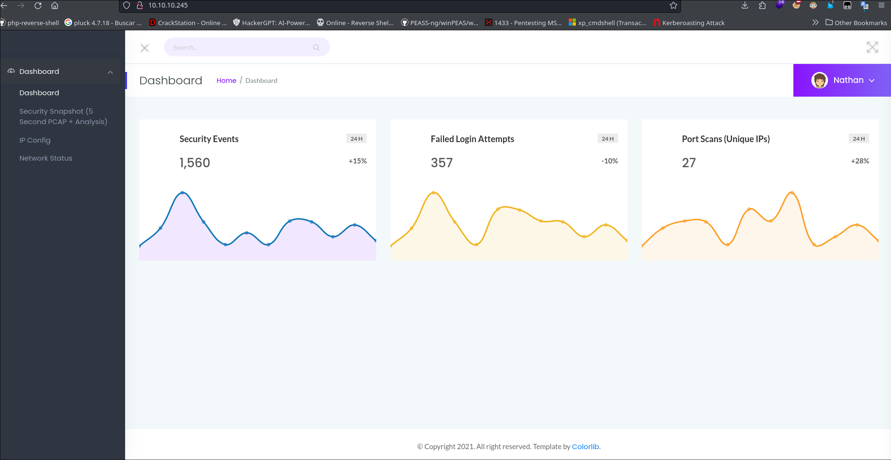
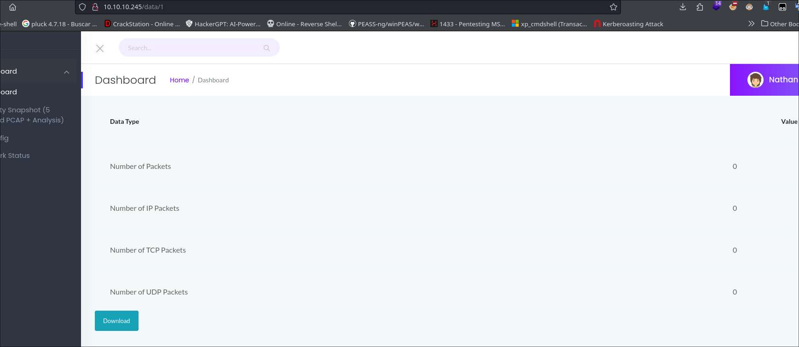
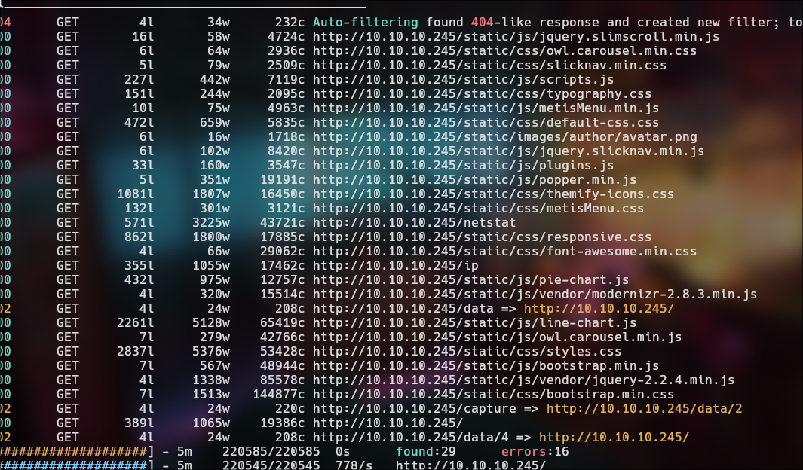
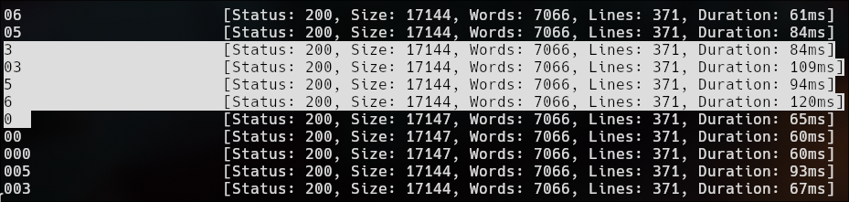
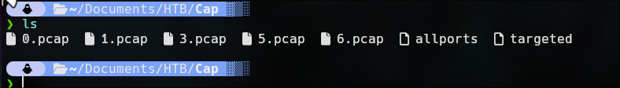
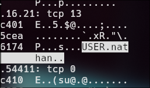
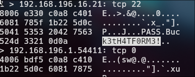
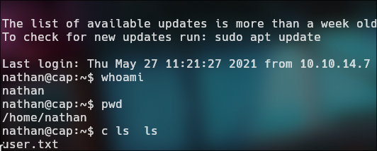
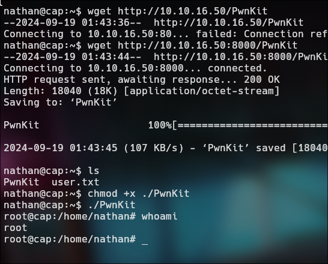

 
## Box Info

| Name                  | Cap              | 
| :-------------------- | ---------------: |
| Release Date          | 5 Jun, 2024      |
| OS                    | Linux            |
| Rated Difficulty      | Easy             |


## Ping 

```bash
ping -c 3 10.10.10.245

PING 10.10.10.245 (10.10.10.245) 56(84) bytes of data.
64 bytes from 10.10.10.245: icmp_seq=1 ttl=63 time=55.6 ms
64 bytes from 10.10.10.245: icmp_seq=2 ttl=63 time=55.9 ms
64 bytes from 10.10.10.245: icmp_seq=3 ttl=63 time=54.8 ms
```

`ttl=63 -> Linux System`

## Nmap

```bash
nmap -p- --open --min-rate 5000 -n -sS -vvv -Pn 10.10.10.245
```

```bash
PORT   STATE SERVICE VERSION
21/tcp open  ftp     vsftpd 3.0.3
22/tcp open  ssh     OpenSSH 8.2p1 Ubuntu 4ubuntu0.1 (Ubuntu Linux; protocol 2.0)
| ssh-hostkey:
|   3072 fa:80:a9:b2:ca:3b:88:69:a4:28:9e:39:0d:27:d5:75 (RSA)
|   256 96:d8:f8:e3:e8:f7:71:36:c5:49:d5:9d:b6:a4:c9:0c (ECDSA)
|_  256 3f:d0:ff:91:eb:3b:f6:e1:9f:2e:8d:de:b3:de:b2:18 (ED25519)
80/tcp open  http    gunicorn                              
| fingerprint-strings:
|   FourOhFourRequest:
|     HTTP/1.0 404 NOT FOUND                                    
|     Server: gunicorn                                                 
|     Date: Sat, 22 May 2021 10:51:48 GMT
|     Connection: close                                                
|     Content-Type: text/html; charset=utf-8
|     Content-Length: 232
|     <!DOCTYPE HTML PUBLIC "-//W3C//DTD HTML 3.2 Final//EN">
|     <title>404 Not Found</title>                                             
|     <h1>Not Found</h1>               
|     <p>The requested URL was not found on the server. If you entered the URL manually please check your spelling and try again.</p>                         
|   GetRequest:                        
|     HTTP/1.0 200 OK                  
|     Server: gunicorn                 
|     Date: Sat, 22 May 2021 10:51:42 GMT                                      
|     Connection: close                
|     Content-Type: text/html; charset=utf-8                                   
|     Content-Length: 19386                                                    
|     <!DOCTYPE html>                  
|     <html class="no-js" lang="en">                                           
|     <head>
...[snip]...
SF:eck\x20your\x20spelling\x20and\x20try\x20again\.</p>\n");
Service Info: OSs: Unix, Linux; CPE: cpe:/o:linux:linux_kernel
```



data/1



I starter with a scan directoriy but dont foudn anything interesting



## Information Disclosure

```bash
ffuf -w /usr/share/seclists/Discovery/Web-Content/directory-list-2.3-small.txt -u 'http://10.10.10.245/data/FUZZ' -fs 208
```



I download those and i test one by one to found sensitive data



```bash
tcpdump -qns 0 -X -r 0.pcap
```

**User:**



**Password:**



`nathan`

`Buck3tH4TF0RM3!`


**Login with ssh**



## Escalation Privilege | CVE-2021-4034

```BASH
find / -perm -4000 2>/dev/null
```


We found a bin interesting called pkexec. Looking if the pkexec has a vulnerability, i find a CVE-2021-4034

https://github.com/ly4k/PwnKit

We upload the file PwnKit and exploit as nathan and BOOM!



Pwned!! 