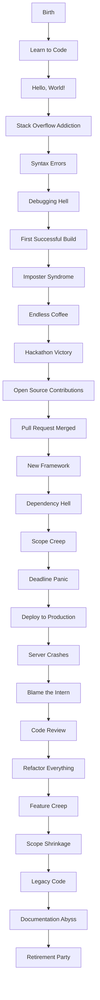

---
# the default layout is 'page'
icon: fas fa-info-circle
order: 4
mermaid: true
---

## Mermaid SVG

```mermaid
graph TD
    A[Birth] --> B[Learn to Code]
    B --> C[Hello, World!]
    C --> D[Stack Overflow Addiction]
    D --> E[Syntax Errors]
    E --> F[Debugging Hell]
    F --> G[First Successful Build]
    G --> H[Imposter Syndrome]
    H --> I[Endless Coffee]
    I --> J[Hackathon Victory]
    J --> K[Open Source Contributions]
    K --> L[Pull Request Merged]
    L --> M[New Framework]
    M --> N[Dependency Hell]
    N --> O[Scope Creep]
    O --> P[Deadline Panic]
    P --> Q[Deploy to Production]
    Q --> R[Server Crashes]
    R --> S[Blame the Intern]
    S --> T[Code Review]
    T --> U[Refactor Everything]
    U --> V[Feature Creep]
    V --> W[Scope Shrinkage]
    W --> X[Legacy Code]
    X --> Y[Documentation Abyss]
    Y --> Z[Retirement Party]
```
